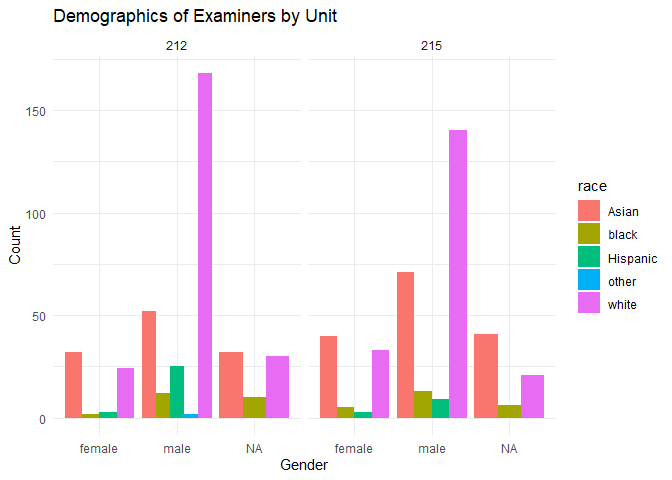
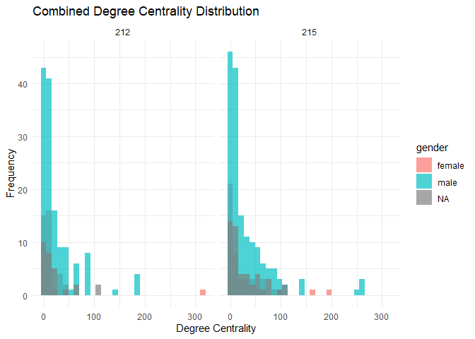
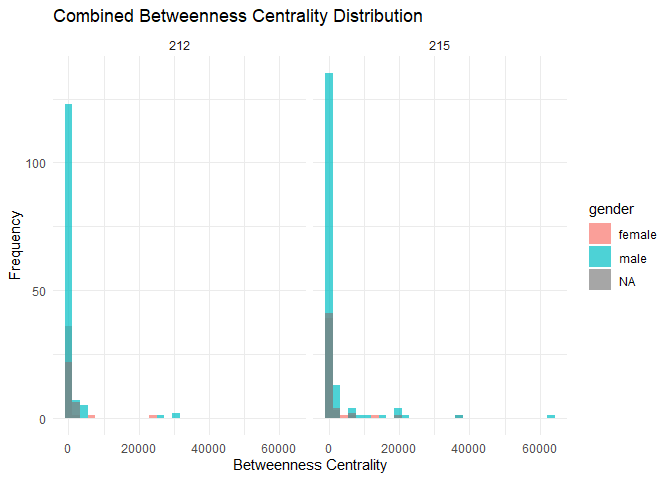
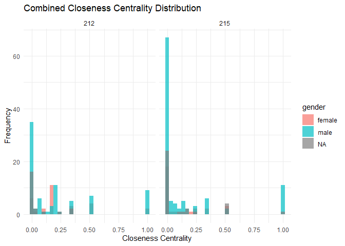

Exercise 3 starter
================

## Load data

Load the following data: + applications from `app_data_sample.parquet` +
edges from `edges_sample.csv`

``` r
# change to your own path!
data_path = "C:/Users/csg20/OneDrive/Desktop/Git/MMA/2024 Winter/ORGB-672/Ex3/"
app_data_sample <- read_parquet(paste0(data_path,"app_data_sample.parquet"))

app_data_sample
```

    ## # A tibble: 2,018,477 × 16
    ##    application_number filing_date examiner_name_last examiner_name_first
    ##    <chr>              <date>      <chr>              <chr>              
    ##  1 08284457           2000-01-26  HOWARD             JACQUELINE         
    ##  2 08413193           2000-10-11  YILDIRIM           BEKIR              
    ##  3 08531853           2000-05-17  HAMILTON           CYNTHIA            
    ##  4 08637752           2001-07-20  MOSHER             MARY               
    ##  5 08682726           2000-04-10  BARR               MICHAEL            
    ##  6 08687412           2000-04-28  GRAY               LINDA              
    ##  7 08716371           2004-01-26  MCMILLIAN          KARA               
    ##  8 08765941           2000-06-23  FORD               VANESSA            
    ##  9 08776818           2000-02-04  STRZELECKA         TERESA             
    ## 10 08809677           2002-02-20  KIM                SUN                
    ## # ℹ 2,018,467 more rows
    ## # ℹ 12 more variables: examiner_name_middle <chr>, examiner_id <dbl>,
    ## #   examiner_art_unit <dbl>, uspc_class <chr>, uspc_subclass <chr>,
    ## #   patent_number <chr>, patent_issue_date <date>, abandon_date <date>,
    ## #   disposal_type <chr>, appl_status_code <dbl>, appl_status_date <chr>,
    ## #   tc <dbl>

## Get gender for examiners

We’ll get gender based on the first name of the examiner, which is
recorded in the field `examiner_name_first`. We’ll use library `gender`
for that, relying on a modified version of their own
[example](https://cran.r-project.org/web/packages/gender/vignettes/predicting-gender.html).

Note that there are over 2 million records in the applications table –
that’s because there are many records for each examiner, as many as the
number of applications that examiner worked on during this time frame.
Our first step therefore is to get all *unique* names in a separate list
`examiner_names`. We will then guess gender for each one and will join
this table back to the original dataset. So, let’s get names without
repetition:

``` r
library(gender)
```

    ## Warning: package 'gender' was built under R version 4.2.3

``` r
#install_genderdata_package() # only run this line the first time you use the package, to get data for it

# get a list of first names without repetitions
examiner_names <- app_data_sample %>% 
  distinct(examiner_name_first)

examiner_names
```

    ## # A tibble: 2,595 × 1
    ##    examiner_name_first
    ##    <chr>              
    ##  1 JACQUELINE         
    ##  2 BEKIR              
    ##  3 CYNTHIA            
    ##  4 MARY               
    ##  5 MICHAEL            
    ##  6 LINDA              
    ##  7 KARA               
    ##  8 VANESSA            
    ##  9 TERESA             
    ## 10 SUN                
    ## # ℹ 2,585 more rows

Now let’s use function `gender()` as shown in the example for the
package to attach a gender and probability to each name and put the
results into the table `examiner_names_gender`. Note that the first time
you run this code, you need to say “Yes” in the console to download the
gender data.

``` r
# get a table of names and gender
examiner_names_gender <- examiner_names %>% 
  do(results = gender(.$examiner_name_first, method = "ssa")) %>% 
  unnest(cols = c(results), keep_empty = TRUE) %>% 
  select(
    examiner_name_first = name,
    gender,
    proportion_female
  )

examiner_names_gender
```

    ## # A tibble: 1,822 × 3
    ##    examiner_name_first gender proportion_female
    ##    <chr>               <chr>              <dbl>
    ##  1 AARON               male              0.0082
    ##  2 ABDEL               male              0     
    ##  3 ABDOU               male              0     
    ##  4 ABDUL               male              0     
    ##  5 ABDULHAKIM          male              0     
    ##  6 ABDULLAH            male              0     
    ##  7 ABDULLAHI           male              0     
    ##  8 ABIGAIL             female            0.998 
    ##  9 ABIMBOLA            female            0.944 
    ## 10 ABRAHAM             male              0.0031
    ## # ℹ 1,812 more rows

Finally, let’s join that table back to our original applications data
and discard the temporary tables we have just created to reduce clutter
in our environment.

``` r
# remove extra colums from the gender table
examiner_names_gender <- examiner_names_gender %>% 
  select(examiner_name_first, gender)

# joining gender back to the dataset
applications <- app_data_sample %>% 
  left_join(examiner_names_gender, by = "examiner_name_first")

# cleaning up
rm(examiner_names)
rm(examiner_names_gender)
gc()
```

    ##            used  (Mb) gc trigger  (Mb) max used  (Mb)
    ## Ncells  4479280 239.3    8266318 441.5  4905067 262.0
    ## Vcells 77674996 592.7  114452759 873.3 79732227 608.4

## Guess the examiner’s race

We’ll now use package `wru` to estimate likely race of an examiner. Just
like with gender, we’ll get a list of unique names first, only now we
are using surnames.

``` r
library(wru)
```

    ## Warning: package 'wru' was built under R version 4.2.3

    ## 
    ## Please cite as:
    ## 
    ## Khanna K, Bertelsen B, Olivella S, Rosenman E, Rossell Hayes A, Imai K
    ## (2024). _wru: Who are You? Bayesian Prediction of Racial Category Using
    ## Surname, First Name, Middle Name, and Geolocation_. R package version
    ## 3.0.1, <https://CRAN.R-project.org/package=wru>.
    ## 
    ## Note that wru 2.0.0 uses 2020 census data by default.
    ## Use the argument `year = "2010"`, to replicate analyses produced with earlier package versions.

``` r
examiner_surnames <- applications %>% 
  select(surname = examiner_name_last) %>% 
  distinct()

examiner_surnames
```

    ## # A tibble: 3,806 × 1
    ##    surname   
    ##    <chr>     
    ##  1 HOWARD    
    ##  2 YILDIRIM  
    ##  3 HAMILTON  
    ##  4 MOSHER    
    ##  5 BARR      
    ##  6 GRAY      
    ##  7 MCMILLIAN 
    ##  8 FORD      
    ##  9 STRZELECKA
    ## 10 KIM       
    ## # ℹ 3,796 more rows

We’ll follow the instructions for the package outlined here
<https://github.com/kosukeimai/wru>.

``` r
examiner_race <- predict_race(voter.file = examiner_surnames, surname.only = T) %>% 
  as_tibble()
```

    ## Predicting race for 2020

    ## Warning: Unknown or uninitialised column: `state`.

    ## Proceeding with last name predictions...

    ## ℹ All local files already up-to-date!

    ## 701 (18.4%) individuals' last names were not matched.

``` r
examiner_race
```

    ## # A tibble: 3,806 × 6
    ##    surname    pred.whi pred.bla pred.his pred.asi pred.oth
    ##    <chr>         <dbl>    <dbl>    <dbl>    <dbl>    <dbl>
    ##  1 HOWARD       0.597   0.295    0.0275   0.00690   0.0741
    ##  2 YILDIRIM     0.807   0.0273   0.0694   0.0165    0.0798
    ##  3 HAMILTON     0.656   0.239    0.0286   0.00750   0.0692
    ##  4 MOSHER       0.915   0.00425  0.0291   0.00917   0.0427
    ##  5 BARR         0.784   0.120    0.0268   0.00830   0.0615
    ##  6 GRAY         0.640   0.252    0.0281   0.00748   0.0724
    ##  7 MCMILLIAN    0.322   0.554    0.0212   0.00340   0.0995
    ##  8 FORD         0.576   0.320    0.0275   0.00621   0.0697
    ##  9 STRZELECKA   0.472   0.171    0.220    0.0825    0.0543
    ## 10 KIM          0.0169  0.00282  0.00546  0.943     0.0319
    ## # ℹ 3,796 more rows

As you can see, we get probabilities across five broad US Census
categories: white, black, Hispanic, Asian and other. (Some of you may
correctly point out that Hispanic is not a race category in the US
Census, but these are the limitations of this package.)

Our final step here is to pick the race category that has the highest
probability for each last name and then join the table back to the main
applications table. See this example for comparing values across
columns: <https://www.tidyverse.org/blog/2020/04/dplyr-1-0-0-rowwise/>.
And this one for `case_when()` function:
<https://dplyr.tidyverse.org/reference/case_when.html>.

``` r
examiner_race <- examiner_race %>% 
  mutate(max_race_p = pmax(pred.asi, pred.bla, pred.his, pred.oth, pred.whi)) %>% 
  mutate(race = case_when(
    max_race_p == pred.asi ~ "Asian",
    max_race_p == pred.bla ~ "black",
    max_race_p == pred.his ~ "Hispanic",
    max_race_p == pred.oth ~ "other",
    max_race_p == pred.whi ~ "white",
    TRUE ~ NA_character_
  ))

examiner_race
```

    ## # A tibble: 3,806 × 8
    ##    surname    pred.whi pred.bla pred.his pred.asi pred.oth max_race_p race 
    ##    <chr>         <dbl>    <dbl>    <dbl>    <dbl>    <dbl>      <dbl> <chr>
    ##  1 HOWARD       0.597   0.295    0.0275   0.00690   0.0741      0.597 white
    ##  2 YILDIRIM     0.807   0.0273   0.0694   0.0165    0.0798      0.807 white
    ##  3 HAMILTON     0.656   0.239    0.0286   0.00750   0.0692      0.656 white
    ##  4 MOSHER       0.915   0.00425  0.0291   0.00917   0.0427      0.915 white
    ##  5 BARR         0.784   0.120    0.0268   0.00830   0.0615      0.784 white
    ##  6 GRAY         0.640   0.252    0.0281   0.00748   0.0724      0.640 white
    ##  7 MCMILLIAN    0.322   0.554    0.0212   0.00340   0.0995      0.554 black
    ##  8 FORD         0.576   0.320    0.0275   0.00621   0.0697      0.576 white
    ##  9 STRZELECKA   0.472   0.171    0.220    0.0825    0.0543      0.472 white
    ## 10 KIM          0.0169  0.00282  0.00546  0.943     0.0319      0.943 Asian
    ## # ℹ 3,796 more rows

Let’s join the data back to the applications table.

``` r
# removing extra columns
examiner_race <- examiner_race %>% 
  select(surname,race)

applications <- applications %>% 
  left_join(examiner_race, by = c("examiner_name_last" = "surname"))

rm(examiner_race)
rm(examiner_surnames)
gc()
```

    ##            used  (Mb) gc trigger   (Mb)  max used  (Mb)
    ## Ncells  4679316 250.0    8266318  441.5   7471124 399.1
    ## Vcells 80015462 610.5  139304153 1062.9 116392263 888.1

## Examiner’s tenure

To figure out the timespan for which we observe each examiner in the
applications data, let’s find the first and the last observed date for
each examiner. We’ll first get examiner IDs and application dates in a
separate table, for ease of manipulation. We’ll keep examiner ID (the
field `examiner_id`), and earliest and latest dates for each application
(`filing_date` and `appl_status_date` respectively). We’ll use functions
in package `lubridate` to work with date and time values.

``` r
library(lubridate) # to work with dates

examiner_dates <- applications %>% 
  select(examiner_id, filing_date, appl_status_date) 

examiner_dates
```

    ## # A tibble: 2,018,477 × 3
    ##    examiner_id filing_date appl_status_date  
    ##          <dbl> <date>      <chr>             
    ##  1       96082 2000-01-26  30jan2003 00:00:00
    ##  2       87678 2000-10-11  27sep2010 00:00:00
    ##  3       63213 2000-05-17  30mar2009 00:00:00
    ##  4       73788 2001-07-20  07sep2009 00:00:00
    ##  5       77294 2000-04-10  19apr2001 00:00:00
    ##  6       68606 2000-04-28  16jul2001 00:00:00
    ##  7       89557 2004-01-26  15may2017 00:00:00
    ##  8       97543 2000-06-23  03apr2002 00:00:00
    ##  9       98714 2000-02-04  27nov2002 00:00:00
    ## 10       65530 2002-02-20  23mar2009 00:00:00
    ## # ℹ 2,018,467 more rows

The dates look inconsistent in terms of formatting. Let’s make them
consistent. We’ll create new variables `start_date` and `end_date`.

``` r
examiner_dates <- examiner_dates %>% 
  mutate(start_date = ymd(filing_date), end_date = as_date(dmy_hms(appl_status_date)))
```

Let’s now identify the earliest and the latest date for each examiner
and calculate the difference in days, which is their tenure in the
organization.

``` r
examiner_dates <- examiner_dates %>% 
  group_by(examiner_id) %>% 
  summarise(
    earliest_date = min(start_date, na.rm = TRUE), 
    latest_date = max(end_date, na.rm = TRUE),
    tenure_days = interval(earliest_date, latest_date) %/% days(1)
    ) %>% 
  filter(year(latest_date)<2018)

examiner_dates
```

    ## # A tibble: 5,625 × 4
    ##    examiner_id earliest_date latest_date tenure_days
    ##          <dbl> <date>        <date>            <dbl>
    ##  1       59012 2004-07-28    2015-07-24         4013
    ##  2       59025 2009-10-26    2017-05-18         2761
    ##  3       59030 2005-12-12    2017-05-22         4179
    ##  4       59040 2007-09-11    2017-05-23         3542
    ##  5       59052 2001-08-21    2007-02-28         2017
    ##  6       59054 2000-11-10    2016-12-23         5887
    ##  7       59055 2004-11-02    2007-12-26         1149
    ##  8       59056 2000-03-24    2017-05-22         6268
    ##  9       59074 2000-01-31    2017-03-17         6255
    ## 10       59081 2011-04-21    2017-05-19         2220
    ## # ℹ 5,615 more rows

Joining back to the applications data.

``` r
applications <- applications %>% 
  left_join(examiner_dates, by = "examiner_id")

rm(examiner_dates)
gc()
```

    ##            used  (Mb) gc trigger   (Mb)  max used   (Mb)
    ## Ncells  4685775 250.3   15250682  814.5  15250682  814.5
    ## Vcells 92377137 704.8  167244983 1276.0 167183063 1275.6

## Pick two workgroups you want to focus on (remember that a workgroup is represented by the first 3 digits of \`examiner_art_unit\` value)

By research online, I found [**Technology Center
2100**](https://www.uspto.gov/patent/contact-patents/tc-2100-management-roster) provides
examination for patent applications including Computer Architecture
Software and Information Security.

#### **2120 AI & Simulation/Modeling**

| Art Unit | Supervisory Patent Examiner (SPE) | Telephone    |
|----------|-----------------------------------|--------------|
| 2120     | Robert Cassity (WQAS)             | 571-270-3150 |
| 2121     | Li Zhen                           | 571-272-3768 |
| 2122     | Kakali Chaki                      | 571-272-3719 |
| 2123     | Alexey Shmatov                    | 571-270-3428 |
| 2124     | Miranda Huang                     | 571-270-7092 |
| 2125     | Kamran Afshar                     | 571-272-7796 |
| 2126     | Ann Lo                            | 571-272-9767 |
| 2127     | Abdullah Kawsar                   | 571-270-3169 |
| 2128     | Omar Fernandez-Rivas              | 571-272-2589 |
| 2129     | Micheal Huntley                   | 303-279-4307 |

#### **2150/2160 Data Bases & File Management**

| Art Unit | Supervisory Patent Examiner (SPE) | Telephone    |
|----------|-----------------------------------|--------------|
| 2150/60  | David Brooks (WQAS)               | 571-272-3334 |
| 2152     | Neveen Abel-Jalil                 | 571-272-4074 |
| 2153     | Hosain Alam (Acting)              | 571-272-3978 |
| 2154     | Hosain Alam                       | 571-272-3978 |
| 2156     | Ajay Bhatia                       | 571-272-3906 |
| 2159     | Mariela Reyes                     | 571-270-1006 |
| 2161     | Apu Mofiz                         | 571-272-4080 |
| 2162     | Pierre Vital                      | 571-272-4215 |
| 2163     | Tony Mahmoudi                     | 571-272-4078 |
| 2164     | Amy Ng                            | 571-270-1698 |
| 2165     | Aleksandr Kerzhner                | 571-270-1760 |
| 2166     | Mark Featherstone                 | 571-270-3750 |
| 2167     | Robert Beausoliel                 | 571-272-3645 |
| 2168     | Fred Ehichioya                    | 571-272-4034 |
| 2169     | Sherief Badawi                    | 571-272-9782 |

So, I want to discover the connection between 212 and 215.

--------------------------------------------------------------------------------------------------------------------

First clean up applications and filter out unit 212 and 215

``` r
# convert applications to distinct examiner level 
examiner = applications %>%
  select(examiner_art_unit, examiner_id, gender, race, tenure_days) %>%
  distinct()

# convert examiner_art_unit to str 
examiner <- examiner %>%
  mutate(examiner_art_unit_str = as.character(examiner_art_unit))

# filter out unit 212 & 215
unit_212 <- examiner %>%
  filter(str_detect(examiner_art_unit_str, "^212"))

unit_215 <- examiner %>%
  filter(str_detect(examiner_art_unit_str, "^215"))
```

calculate summary stats

``` r
# Add unit column and sort by gender count for unit 212
gender_summary_212 <- unit_212 %>%
  group_by(gender) %>%
  summarise(count = n(), .groups = 'drop') %>%
  mutate(unit = '212') %>%
  arrange(desc(count))

# Add unit column and sort by gender count for unit 215
gender_summary_215 <- unit_215 %>%
  group_by(gender) %>%
  summarise(count = n(), .groups = 'drop') %>%
  mutate(unit = '215') %>%
  arrange(desc(count))

# Combine the gender summaries into one data frame
combined_gender_summary <- rbind(gender_summary_212, gender_summary_215)

# Display combined and sorted gender summary
print("Combined and Sorted Gender Summary")
```

    ## [1] "Combined and Sorted Gender Summary"

``` r
print(combined_gender_summary)
```

    ## # A tibble: 6 × 3
    ##   gender count unit 
    ##   <chr>  <int> <chr>
    ## 1 male     259 212  
    ## 2 <NA>      72 212  
    ## 3 female    61 212  
    ## 4 male     233 215  
    ## 5 female    81 215  
    ## 6 <NA>      68 215

``` r
race_summary_212 <- unit_212 %>%
  group_by(race) %>%
  summarise(count = n(), .groups = 'drop') %>%
  mutate(unit = '212') %>%
  arrange(desc(count))

# Add unit column and sort by race count for unit 215
race_summary_215 <- unit_215 %>%
  group_by(race) %>%
  summarise(count = n(), .groups = 'drop') %>%
  mutate(unit = '215') %>%
  arrange(desc(count))

# Combine the race summaries into one data frame
combined_race_summary <- rbind(race_summary_212, race_summary_215)

# Display combined and sorted race summary
print("Combined and Sorted Race Summary")
```

    ## [1] "Combined and Sorted Race Summary"

``` r
print(combined_race_summary)
```

    ## # A tibble: 9 × 3
    ##   race     count unit 
    ##   <chr>    <int> <chr>
    ## 1 white      222 212  
    ## 2 Asian      116 212  
    ## 3 Hispanic    28 212  
    ## 4 black       24 212  
    ## 5 other        2 212  
    ## 6 white      194 215  
    ## 7 Asian      152 215  
    ## 8 black       24 215  
    ## 9 Hispanic    12 215

prepare data for the plot

``` r
summary_212 <- unit_212 %>%
  group_by(gender, race) %>%
  summarise(count = n(), .groups = 'drop')

summary_215 <- unit_215 %>%
  group_by(gender, race) %>%
  summarise(count = n(), .groups = 'drop')

#combine data

summary_212$unit <- '212'
summary_215$unit <- '215'

combined_summary <- rbind(summary_212, summary_215)
```

plot demographic

``` r
library(ggplot2)

ggplot(combined_summary, aes(fill = race, x = gender, y = count)) + 
  geom_bar(position = "dodge", stat = "identity") +
  facet_wrap(~unit) +
  labs(title = "Demographics of Examiners by Unit",
       x = "Gender",
       y = "Count") +
  theme_minimal()
```

<!-- -->

### **Gender:**

- **Unit 212**: Has a higher number of male examiners (259) compared to
  female (61), with 72 examiners whose gender is not available (NA).

- **Unit 215**: Also has more male examiners (233) than female (81),
  with a slightly lower number of NA gender data (68).

### **Race:**

- **Unit 212**: Predominantly white (222), followed by Asian (116),
  Hispanic (28), black (24), and other (2).

- **Unit 215**: Again, predominantly white (194), but with a higher
  count of Asians (152) than unit 212, followed by black (24), and
  Hispanic (12).

### **Overall:**

- **Gender**: Both units show a higher proportion of male examiners, but
  unit 215 is relatively more balanced in gender distribution than unit
  212.

- **Race**: Both units are predominantly white, but unit 215 has a
  larger proportion of Asian examiners, while unit 212 has more Hispanic
  examiners. Both units have the same number of black examiners.

## Create advice networks from \`edges_sample\` and calculate centrality scores for examiners in your selected workgroups

``` r
#read data
edge = read.csv('edges_sample.csv')
```

``` r
library(igraph)
```

    ## Warning: package 'igraph' was built under R version 4.2.3

    ## 
    ## Attaching package: 'igraph'

    ## The following objects are masked from 'package:lubridate':
    ## 
    ##     %--%, union

    ## The following objects are masked from 'package:dplyr':
    ## 
    ##     as_data_frame, groups, union

    ## The following objects are masked from 'package:purrr':
    ## 
    ##     compose, simplify

    ## The following object is masked from 'package:tidyr':
    ## 
    ##     crossing

    ## The following object is masked from 'package:tibble':
    ## 
    ##     as_data_frame

    ## The following objects are masked from 'package:stats':
    ## 
    ##     decompose, spectrum

    ## The following object is masked from 'package:base':
    ## 
    ##     union

create networks

``` r
g <- graph_from_data_frame(d = edge[, c("ego_examiner_id", "alter_examiner_id")], directed = TRUE)
```

    ## Warning in graph_from_data_frame(d = edge[, c("ego_examiner_id",
    ## "alter_examiner_id")], : In `d' `NA' elements were replaced with string "NA"

Calculate centralities

``` r
degree_centrality <- degree(g, mode = "all")
betweenness_centrality <- betweenness(g, directed = TRUE)
closeness_centrality <- closeness(g)
```

merge score back to original unit212&215 dataset

``` r
centrality_scores <- data.frame(
  examiner_id = V(g)$name,
  degree = degree_centrality,
  betweenness = betweenness_centrality,
  closeness = closeness_centrality
)

unit_212$examiner_id <- as.character(unit_212$examiner_id)
unit_215$examiner_id <- as.character(unit_215$examiner_id)
centrality_scores$examiner_id <- as.character(centrality_scores$examiner_id)


unit_212_with_scores <- unit_212 %>%
  left_join(centrality_scores, by = "examiner_id")

unit_215_with_scores <- unit_215 %>%
  left_join(centrality_scores, by = "examiner_id")
```

visualize the centrality score distribution based on gender

``` r
unit_212_ids <- unique(unit_212$examiner_id)
unit_215_ids <- unique(unit_215$examiner_id)

# Combine the centrality scores from both units
combined_centrality_scores <- rbind(unit_212_with_scores, unit_215_with_scores) %>%
  mutate(unit = ifelse(examiner_id %in% unit_212_ids, '212', '215'))

# Now create combined histograms based on gender

# Histograms for degree centrality distribution
ggplot(combined_centrality_scores, aes(x = degree, fill = gender)) +
  geom_histogram(bins = 30, alpha = 0.7, position = 'identity') +
  labs(title = 'Combined Degree Centrality Distribution', x = 'Degree Centrality', y = 'Frequency') +
  facet_grid(. ~ unit) +
  theme_minimal()
```

    ## Warning: Removed 313 rows containing non-finite outside the scale range
    ## (`stat_bin()`).

<!-- -->

``` r
ggplot(combined_centrality_scores, aes(x = betweenness, fill = gender)) +
  geom_histogram(bins = 30, alpha = 0.7, position = 'identity') +
  labs(title = 'Combined Betweenness Centrality Distribution', x = 'Betweenness Centrality', y = 'Frequency') +
  facet_grid(. ~ unit) +
  theme_minimal()
```

    ## Warning: Removed 313 rows containing non-finite outside the scale range
    ## (`stat_bin()`).

<!-- -->

``` r
ggplot(combined_centrality_scores, aes(x = closeness, fill = gender)) +
  geom_histogram(bins = 30, alpha = 0.7, position = 'identity') +
  labs(title = 'Combined Closeness Centrality Distribution', x = 'Closeness Centrality', y = 'Frequency') +
  facet_grid(. ~ unit) +
  theme_minimal()
```

    ## Warning: Removed 473 rows containing non-finite outside the scale range
    ## (`stat_bin()`).

<!-- -->

### Choice of Centrality Measures

- **Degree Centrality** - my primary measure because it reflects
  immediate engagement in the advice process. It’s straightforward and
  indicates how involved individuals are in the network.

- **Betweenness Centrality** - the secondary measure, valuable for
  identifying those who have control over the information flow between
  other members of the network. High betweenness centrality individuals
  are key to maintaining network cohesion and can be crucial for
  targeted interventions.

### Characterize and discuss the relationship between centrality and other examiners’ characteristics

#### **Degree Centrality:**

The “Combined Degree Centrality Distribution” histogram shows that in
both units, male examiners tend to have a higher degree centrality than
females and those whose gender is not available (NA). This suggests that
male examiners might be more actively involved in giving and receiving
advice within these units.

#### **Betweenness Centrality:**

From the “Combined Betweenness Centrality Distribution” histogram, it
appears that male examiners also tend to have higher betweenness
centrality scores, indicating they often act as bridges in the
communication paths of the network. If few individuals are critical for
the flow of information, it might indicate that targeting these key
players could effectively spread important messages or changes
throughout the network.

#### **Demographics:**

The “Demographics of Examiners by Unit” graph indicates that there are
more male examiners in both units. This majority may contribute to the
skew in centrality measures towards males.

#### **Gender Centrality Relationship:**

Considering the histograms and the demographic data together, it seems
there is a relationship between gender and centrality measures in your
data, with male examiners generally showing higher centrality. This
could reflect a variety of factors, such as:

- **Network Position**: Male examiners may occupy more central roles
  within the network due to a larger number of connections or being at
  strategic points in the network structure.

- **Activity Levels**: The higher centrality scores for males could be
  due to higher activity levels—more interactions or involvement in the
  advice-giving process.

- **Influence and Hierarchical Positions**: If centrality correlates
  with seniority or influence, it might indicate that male examiners
  hold positions that naturally result in higher centrality due to their
  roles within the organization.
